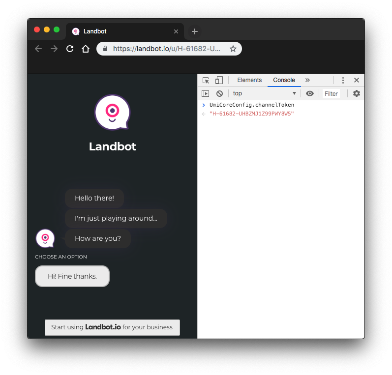

# Install

### ES6
```bash
npm install @landbot/core
```
Import it in your app.
```javascript
import * as Landbot from '@landbot/core';
import * as firebase from 'firebase/app';
import 'firebase/auth';
import 'firebase/database';

const core = new Landbot.Core({
  firebase: firebase, // required
  brandID: 12235, // required
  channelToken: 'H-116929-N86QGRNNY6QCWEU3', // required
  welcomeUrl: 'https://welcome.landbot.io/', // recommended
});
```

### In the browser
```html
<script src="https://static.landbot.io/landbot-core/landbot-core.js"></script>
<script src="https://www.gstatic.com/firebasejs/5.5.2/firebase.js"></script>

<script>
  var core = new Landbot.Core({
    firebase: firebase, // required
    brandID: 12235, // required
    channelToken: 'H-116929-N86QGRNNY6QCWEU3', // required
    welcomeUrl: 'https://welcome.landbot.io/', // recommended
  });
</script>
```

## Config
| Property | Description |
| --- | --- |
| `firebase` | Firebase dependency. It's required. |
| `brandID` | The brand ID given in Landbot APP. It's required. |
| `channelToken` | The channel token generated by Landbot APP for a specific landbot. It's required. |
| `welcomeUrl` | It's not required, but recommended. If not provided, database auth and connection are made when the bot is triggered. If provided, database auth and connection are made on page load. Use `"https://welcome.landbot.io/"`. |

> Get your `brandID` and `channelToken` from a landbot in the Share URL, they're located in `UmiCoreConfig.brandID` and `UmiCoreConfig.channelToken`.
